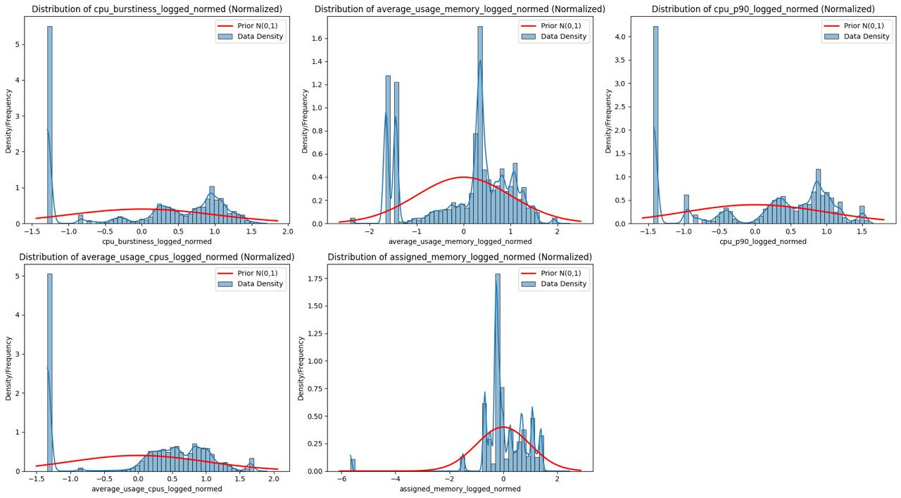
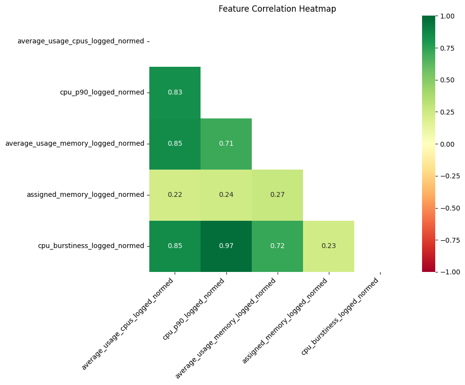
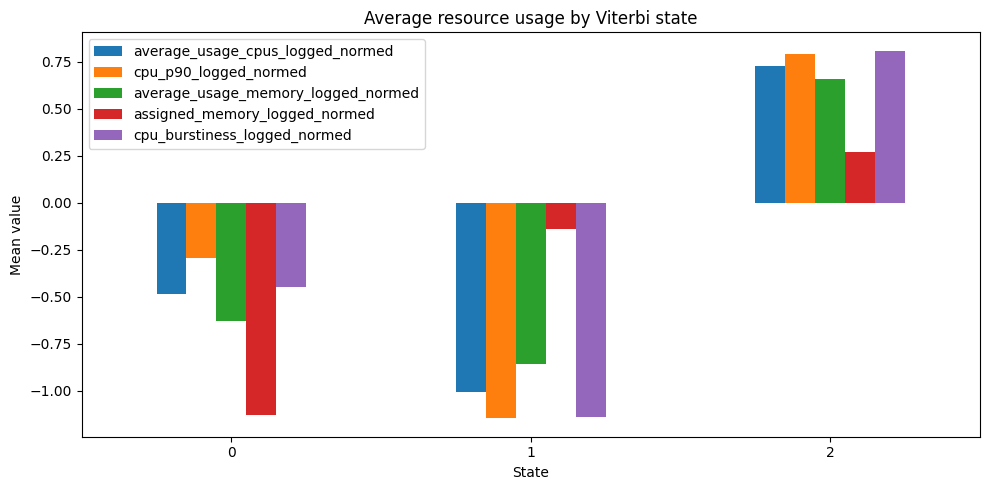
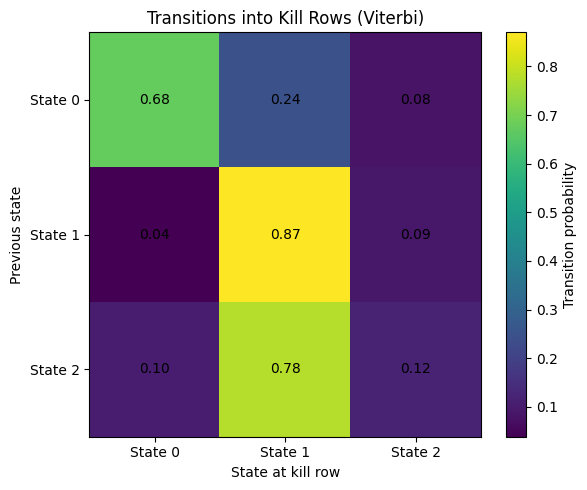

# Bayesian Job Failure Prediction in Distributed Systems

> A Bayesian Hidden Markov Model for discovering latent job health states from Google Borg resource telemetry and identifying regimes that are strongly associated with task failure.

<!-- INSERT HERO FIGURE HERE: one clean summary figure of the project pipeline or state diagram -->

---

## Overview

Modern distributed systems generate enormous streams of telemetry, but failure does not usually appear as a single sudden event. In many cases, jobs drift through a sequence of degraded operating conditions before they are killed, evicted, or fail. This project studies that problem using Google Borg cluster traces and models job behavior as a **Bayesian Hidden Markov Model (HMM)**.

Instead of treating each resource measurement independently, we model each job as a **time-ordered sequence** of observations. The HMM learns a small number of latent states that summarize recurring regimes of behavior in the cluster. These states are not manually labeled. They are learned directly from the resource usage data, and then interpreted by examining how they align with downstream failure events.

The final result is a model that separates jobs into distinct usage regimes and shows that one learned state is consistently much more associated with failure than the others. In our validation analysis, **state 1 emerged as the dominant failure-associated state**, suggesting that the model is capturing a meaningful degraded or pre-failure regime rather than only clustering jobs by generic resource intensity.

---

## Problem Statement

In a cluster scheduler like Borg, jobs do not all behave the same way:

- some jobs are short-lived and bursty
- some are stable and well-behaved
- some gradually become unhealthy before termination
- some are intentionally killed by users or parent cleanup logic
- some fail because of system-level or resource-related issues

A standard row-wise classifier ignores the temporal path of a job. Two jobs can have similar average utilization overall while having very different trajectories over time. What matters is often not only **how much** CPU or memory is being used, but **how the sequence evolves**.

This project addresses that issue by asking:

1. Can we learn latent resource-usage regimes directly from Borg task telemetry?
2. Do those regimes correspond to meaningful notions of healthy vs degraded execution?
3. Is there a particular hidden state that becomes overrepresented in failing jobs?

---

## Main Takeaway

The main finding of this project is that the learned latent states are not arbitrary: they map onto interpretable job behaviors.

Across validation, **state 1 is the state most consistently associated with failure**. This state is characterized by suppressed actual usage across several key metrics, which supports the interpretation that it may represent a **degraded, stalled, or underperforming regime** rather than a healthy low-load regime.

Conceptually:

- **State 2** behaves like an active, healthy, high-usage state
- **State 0** behaves like a lighter or lower-intensity operating state
- **State 1** behaves like the most failure-associated state and likely represents a latent pre-failure condition

This does **not** mean that low usage itself causes failure. Rather, the model suggests that many failing jobs pass through a regime where resources are allocated but not being used productively, which is consistent with hanging, stalling, waiting, or degraded execution.

<!-- INSERT KEY VALIDATION FIGURE HERE: kill distribution by viterbi state -->
<!-- INSERT STATE INTERPRETATION FIGURE HERE: average resource usage by state -->

---

## Dataset

This project uses the **Google Borg Cluster Traces v3 (ClusterData2019)** dataset, which contains one month of production workload traces from Borg-managed clusters.

We focus on the following tables:

### 1. `instance_usage`

This is the core modeling table. It contains per-instance resource measurements at regular time intervals. These measurements form the observation sequences for the HMM.

### 2. `instance_events`

This table records lifecycle events such as task creation, termination, failure, kill, and similar outcomes. We use these events for **evaluation and interpretation**, not as direct model inputs.

### 3. `collection_events`

This table contains job-level metadata used for contextual grouping and filtering.

The overall modeling philosophy is important:

- the HMM is trained on **resource behavior**
- event outcomes are used later to ask whether the learned hidden states are predictive or failure-associated

This keeps the latent-state discovery step unsupervised with respect to the final outcome labels.

---

## Repository Structure

```text
bayesian-failure-prediction-on-cluster-traces/
│
├── data/                  # model and parameter files used as inputs for validation
│   ├── hmm_model_march11.pkl
│   └── norms_params.pkl
├── notebooks/             # end-to-end exploratory and modeling notebooks
│   ├── MCMC.ipynb
│   ├── Transformer.ipynb
│   ├── hmm_model_v01.ipynb
│   ├── hmm_model_v02.ipynb
│   ├── pull_data.ipynb
│   └── validation.ipynb
├── figures/               # saved plots
│   ├── log_normed_features_with_priors.png
│   └── training-loss-march03.png
├── src/                   # modularized helper code
│   ├── data_loader.py
│   ├── data_cleaning.py
│   ├── hmm_decoder.py
│   └── modelling.py
├── requirements.txt
└── README.md
```


## End-to-End Pipeline

This section explains the workflow from raw trace data to final decoded states.

### Step 1: Load the trace data

The project begins by loading resource usage and event data from parquet files. Because the underlying files are large, the workflow includes memory-conscious loading patterns such as selective reads and batch-based reading.

The main training notebook reads `instance_usage` as the starting observation table and also loads `instance_events` for later matching and validation.

### Step 2: Remove duplicates

Before modeling, duplicate rows are removed to avoid double-counting the same job-time observation.

Examples of duplicate handling include:

- removing duplicates from `instance_usage` using keys like collection, instance, and start time
- removing duplicates from `instance_events` using collection, instance, and event time

This is an important quality-control step because HMMs are sequence models. Duplicate records would distort both transition behavior and emission estimates.

### Step 3: Clean types and reduce memory pressure

Several columns are downcast or reformatted to make the dataset easier to work with. This matters because the project deals with large-scale trace data, and preprocessing must remain computationally feasible.

### Step 4: Engineer modeling features

The project does not feed raw event labels into the model. Instead, it constructs a compact feature set summarizing resource behavior.

The final modeling features are:

- `average_usage_cpus_logged_normed`
- `average_usage_memory_logged_normed`
- `assigned_memory_logged_normed`
- `cpu_p90_logged_normed`
- `cpu_burstiness_logged_normed`

These features were selected because they capture complementary aspects of job behavior:

- **average CPU usage** captures sustained compute load
- **average memory usage** captures sustained memory demand
- **assigned memory** captures the requested allocation or resource envelope
- **CPU p90** captures upper-tail CPU pressure
- **CPU burstiness** captures spikiness or instability in CPU demand

Together, these features give the model a view of both average behavior and stress behavior.



*Figure: Distributions of the five final normalized modeling features compared against the standard normal prior used in the Bayesian HMM. This plot shows that after log transformation and normalization, the features are placed on a more comparable scale for modeling, while still retaining meaningful structure such as skewness, multimodality, and concentration in different regions of the feature space.*



*Figure: Correlation heatmap for the final selected modeling features used in the HMM. The selected set preserves key information about CPU load, memory usage, allocation, and burstiness while avoiding an overly redundant input space.*
### Step 5: Apply transformations and normalization

Because raw cluster telemetry can be highly skewed, the project applies transformations to make the feature space more stable for Gaussian emissions.

This includes:

- log-based transformations
- normalization using learned parameters
- carrying normalization parameters forward so the exact same transformation can be applied during validation

This is critical. The validation dataset must be normalized with the same statistics and transformation logic as the training data, otherwise the decoded states would not be comparable.

### Step 6: Construct time-ordered sequences

The HMM requires ordered observation sequences. After cleaning and feature preparation, rows are grouped into per-job or per-instance sequences and sorted by time.

At this stage, each sequence becomes:

- one entity evolving over time
- a matrix of observations
- the input to the latent-state model

### Step 7: Train the Bayesian HMM

The model is implemented in **NumPyro** using **JAX**, with **Stochastic Variational Inference (SVI)** used for fitting.

The HMM learns:

- initial state probabilities
- transition probabilities between states
- Gaussian emission parameters for each state

The state space is fixed to **3 latent states** in the final version.

The choice of a Bayesian HMM is useful because it gives:

- a principled latent temporal structure
- probabilistic uncertainty-aware state inference
- a natural way to model trajectories rather than isolated points

### Step 8: Save learned parameters

After training, the learned model parameters are exported for reuse in downstream decoding. These saved artifacts include items such as:

- `pi`
- `A`
- `mu`
- `sigma`
- `features`
- `K`
- `norm_params`

Saving these parameters allows the model to be applied in a separate notebook without retraining.

### Step 9: Decode hidden states on validation data

The validation notebook loads the saved parameters and applies:

- the **forward algorithm** for posterior state probabilities over time
- the **Viterbi algorithm** for the most likely discrete state path

This produces two useful ways to summarize state membership:

1. **dominant forward state**  
   A probabilistic summary based on posterior state mass.

2. **Viterbi state**  
   A hard decoded path giving the most likely latent state sequence.

### Step 10: Compare decoded states with failure labels

Once the validation set has decoded hidden states, those states are compared with observed kill/failure outcomes. This is how the project moves from unsupervised latent-state learning to meaningful operational interpretation.

---

## Why Hidden Markov Models?

An HMM is a natural fit for this problem because jobs in a distributed system are inherently sequential.

At each time step, we observe resource usage, but the real “health condition” of the job is hidden. The model assumes that:

- each observation is generated from an underlying hidden state
- the hidden state evolves over time according to transition probabilities
- the current hidden state influences the observed CPU/memory pattern

This matters more than a static model because failure is often a **trajectory problem**. Jobs do not instantly switch from healthy to failed. They often pass through one or more intermediate regimes.

An HMM captures exactly that:

- persistence of state
- transitions between regimes
- noisy observations emitted from hidden conditions

---

## Model Interpretation

The hidden states are learned from resource data alone, so their meaning must be inferred after training by examining the average feature values and their association with outcomes.

### State 2: high-usage active regime

State 2 has the highest means across CPU, memory, CPU p90, and burstiness. This looks like the most active operating regime. These jobs are consuming resources and appear to be doing work.

### State 0: lower-intensity regime

State 0 appears to be a lower-load state. It may reflect lighter or less demanding execution, but it does not appear to be the most failure-associated state.

### State 1: degraded / failure-associated regime

State 1 is the most interesting state. It has very low values across multiple actual usage dimensions and emerges as the state most frequently aligned with failure.

A plausible interpretation is that this state corresponds to jobs that have resources allocated but are no longer using them productively. That is consistent with:

- stalling
- hanging
- waiting on blocked work
- degraded execution
- pre-termination behavior

This interpretation is strengthened by the validation results, where state 1 is overrepresented among kill rows.

<!-- INSERT BAR CHART HERE: average resource usage by state -->
<!-- INSERT OPTIONAL HEATMAP HERE: state-feature mean heatmap -->

## Validation and Results

The validation notebook asks a practical question:

> once the model has learned latent states, do those states line up with actual failure outcomes?

The answer is yes, especially for state 1.

### Key validation idea

We compare observed kill rows against decoded hidden states using two perspectives:

#### 1. `P(state | kill)`

Among rows that ended in a kill, which hidden state do they belong to most often?

#### 2. `P(kill | state)`

Given a decoded hidden state, how often do rows in that state correspond to kill outcomes?

Together, these two views help distinguish:

- whether a state is common among failures
- whether being in that state is relatively more dangerous than the alternatives

### Main result

State 1 is the most failure-associated state under both decoding summaries.

This is the central empirical conclusion of the project. The model did not simply cluster jobs by “high” versus “low” usage. Instead, it learned a latent regime that is disproportionately associated with task kills. That regime appears to reflect underproductive or degraded execution rather than healthy low-load activity.

### Why this matters

This is useful because it means the HMM is doing more than compressing the data. It is identifying a hidden operating condition that has operational relevance.

That opens the door to applications such as:

- early warning signals for jobs drifting into unhealthy regimes
- workload monitoring dashboards based on hidden state occupancy
- state-based risk scoring over time
- downstream failure prediction systems that use latent states as features

| Viterbi State | Percent of `kill_row == 1` |
|---|---:|
| 0 | 10.282458% |
| 1 | 80.773043% |
| 2 | 8.944500% |
Among rows where `kill_row == 1`, the vast majority are assigned to **Viterbi state 1**. Specifically, about **80.77%** of kill rows fall into state 1, while only **10.28%** fall into state 0 and **8.94%** fall into state 2. This strongly suggests that state 1 is the hidden state most associated with failure and likely captures a degraded or pre-failure job regime.

| Dominant Forward State | Percent of `kill_row == 1` |
|---|---:|
| 0 | 12.908821% |
| 1 | 77.998018% |
| 2 | 9.093162% |
Among rows where `kill_row == 1`, most are assigned to **dominant forward state 1**. About **78.00%** of kill rows fall into state 1, compared with **12.91%** in state 0 and **9.09%** in state 2. This supports the same conclusion as the Viterbi decoding results: **state 1 is the hidden state most strongly associated with failure**, which suggests it represents a degraded or pre-failure regime.



**Figure:** Average normalized resource usage across Viterbi states. The model identifies three interpretable job regimes: **State 0** represents a **low-utilization** state with below-average usage across all resource metrics, **State 1** represents an **unhealthy-utilization** state where CPU, memory, and burstiness are especially suppressed and align most strongly with failure, and **State 2** represents a **high-utilization** state with consistently elevated usage across all metrics, corresponding to the most active jobs.



**Figure:** Transition patterns into kill rows using Viterbi-decoded states. Most kill events occur when the job is already in **state 1**, or after it transitions into **state 1** from another state. In particular, jobs coming from **state 2** move into **state 1** before a kill much more often than into any other state, which reinforces the interpretation of **state 1** as a degraded pre-failure regime.
---

## What We Learned

This project led to several important conclusions:

### 1. Temporal structure matters

Failure is not just a property of a single row. It is often the result of a sequence moving through hidden regimes.

### 2. Resource telemetry contains meaningful latent state information

CPU and memory behavior alone are sufficient to recover interpretable job regimes.

### 3. One state consistently concentrates failures

The emergence of a single failure-heavy state suggests that hidden-state modeling can help uncover pre-failure signatures in distributed systems.

### 4. Low productive usage can be as informative as high stress

A failure-associated state does not necessarily have to correspond to maximal utilization. In this project, the strongest failure-associated regime looks more like a degraded execution state than an overload state.

---

## Limitations

This project has several limitations that are important to state clearly.

### 1. State meaning is inferred, not labeled

The hidden states are learned unsupervised. Their interpretation comes from post hoc analysis of feature means and alignment with outcomes.

### 2. Failure labels may mix different mechanisms

Not every termination event has the same meaning. Some kills are intentional, while others reflect system problems. That can blur the mapping between latent state and “true failure.”

### 3. Current pipeline is notebook-first

The project has begun modularization into `src/`, but the most complete end-to-end logic currently lives in the notebooks.

### 4. Validation is based on downstream alignment, not a full production alerting benchmark

The project shows that hidden states are informative, but it does not yet implement a complete online forecasting or alerting system.

### 5. State 1 should be interpreted carefully

State 1 is strongly associated with failure, but that does not prove causality. It is better understood as a latent signature of degraded behavior.

---

## Future Work

There are several natural next steps.

### 1. Transition-based early warning

Instead of using only final decoded state membership, detect jobs that are moving **into** state 1 and flag them as elevated risk.

### 2. Time-to-failure analysis

Measure how long before a kill event jobs tend to enter the failure-associated state.

### 3. More explicit sequence-level evaluation

Compare successful and failed jobs by:

- fraction of time spent in each state
- number of transitions
- last-state-before-termination
- transition patterns into the final event

### 4. Stronger modularization

Move the full pipeline from notebook-only logic into clean reusable modules and scripts.

### 5. Hybrid models

Use decoded HMM states as features in a downstream supervised failure-risk model.

### 6. Better label refinement

Separate user-initiated kills, parent cleanup, and infrastructure-related failures more carefully so that the hidden states can be matched to more precise operational outcomes.

---

## Conclusion

This project demonstrates that a Bayesian HMM can recover meaningful hidden regimes from Borg resource telemetry and that those regimes have real predictive value for understanding failure.

The most important conclusion is that **state 1 consistently concentrates failure outcomes**, suggesting that the model has identified a degraded latent operating regime rather than merely clustering by raw utilization level.

That makes hidden-state modeling a promising approach for:

- failure analysis
- temporal workload monitoring
- pre-failure regime detection
- sequence-aware observability in large distributed systems

In short, this project shows that cluster failures leave behind temporal structure before the final event, and Bayesian latent-state models can detect that structure.

---

## Acknowledgments and References

- Google Borg Cluster Traces / ClusterData2019
- NumPyro
- JAX
- PyArrow
- Pandas
- Scikit-learn
- Matplotlib / Seaborn
### Course Acknowledgment

This project was completed as part of **ADSP 32014 IP01: Bayesian Machine Learning with Generative AI Applications** at the **University of Chicago** under the guidance of **Professor Batu Gundogdu**.
